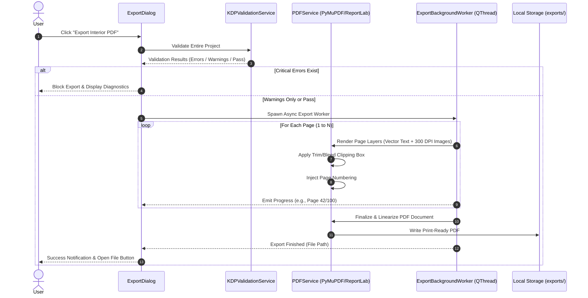

# KDP Book Production Studio - Technical Architecture Document

## 1. Executive Summary & Vision

**KDP Book Production Studio** is a professional, offline-first, high-performance Windows desktop application built in **Python 3.12+** using **PySide6 (Qt6)**. The application automates the end-to-end production workflow for Amazon KDP (Kindle Direct Publishing) children's books (Coloring Books, Tracing Books, Activity Books, Puzzle Books, Dot-to-Dot).

By replacing tedious, error-prone manual page-by-page layout workflows in generic graphic software, the studio enables creators to import asset folders, automatically generate dozens or hundreds of standardized, print-compliant pages, fine-tune individual layouts with precision physical coordinates, perform preflight validation against official KDP print specifications, design matching wraps/covers, and export 300+ DPI KDP-ready interior and cover PDFs in seconds.

---

## 2. High-Level Architecture Diagram

```mermaid
flowchart TB
    subgraph Presentation_Layer [UI / Presentation Layer (PySide6 / Qt6)]
        MainWindow["MainWindow (Navigation Router & Ribbon)"]
        Dashboard["Dashboard (Recent Projects, Quick Start)"]
        ProjectSetup["New Project Wizard"]
        BookSettingsUI["Book Settings Inspector"]
        CanvasEditor["Canvas Editor (QGraphicsView / QGraphicsScene)"]
        PageTimeline["Page Timeline Ribbon (Drag & Drop Reorder)"]
        PropertyInspector["Physical Units Property Inspector"]
        AssetManagerUI["Asset Manager (Grid, Search, Drop Target)"]
        TemplateManagerUI["Template Library & Slot Designer"]
        PreflightPanel["KDP Preflight & Quality Checker"]
        CoverBuilderUI["Cover & Spine Calculator/Builder"]
        PreviewModeUI["Realistic Flipbook & Spread Preview"]
        ExportDialogUI["Multi-Threaded PDF/Raster Exporter"]
    end

    subgraph Modular_Plugin_Engine [Book Module Subsystem]
        BaseBookModule["<<interface>> BookModule"]
        ColoringModule["ColoringBookModule (V1 Primary)"]
        TracingModule["TracingBookModule (Extensible)"]
        ActivityModule["ActivityBookModule (Extensible)"]
        PuzzleModule["PuzzleBookModule (Extensible)"]
        DotToDotModule["DotToDotModule (Extensible)"]
    end

    subgraph Core_Domain_Layer [Core Engine & Document Model]
        UnitsEngine["Units Subsystem (Inches, mm, cm, pt, px)"]
        DocModel["DocumentModel (Pydantic / Dataclasses)"]
        PageModel["PageModel & Layer Subsystem"]
        AssetRegistry["AssetRegistry & Hash Deduplicator"]
        TemplateModel["TemplateModel & Layout Slots"]
        HistoryEngine["History Manager (QUndoStack Command Pattern)"]
        ProjectManager["Project Manager (Atomic IO, Recovery, Autosave)"]
        SettingsManager["Global App Settings (QSettings)"]
    end

    subgraph Service_Infrastructure [Service & Processing Layer]
        ImageProcService["Image Processing Engine (OpenCV / PIL Non-AI)"]
        RenderingService["2D Vector/Raster Rendering Engine (QPainter)"]
        PDFExportEngine["PDF Generation Engine (PyMuPDF / ReportLab)"]
        PreflightService["KDP Validation & Safety Rule Engine"]
        ThumbnailCache["LRU Memory & Disk Thumbnail Cache"]
        FontManagerService["Font Registry & Local TTF/OTF Loader"]
    end

    subgraph Storage_Layer [Storage & Project Workspace Structure]
        ProjectFile["project.json"]
        AssetsDir["assets/ (Raw & Processed Images)"]
        PagesDir["pages/ (Page JSONs & Layer Elements)"]
        PreviewsDir["previews/ (High-Res Proof Renders)"]
        ExportsDir["exports/ (Final Print PDFs)"]
        CoverDir["cover/ (Cover Geometry & Wraps)"]
        CacheDir["cache/ (Downscaled Thumbnails & PyMuPDF Buffers)"]
    end

    MainWindow --> Dashboard
    MainWindow --> CanvasEditor
    MainWindow --> BookSettingsUI
    MainWindow --> CoverBuilderUI
    MainWindow --> PreviewModeUI
    MainWindow --> ExportDialogUI

    CanvasEditor --> Core_Domain_Layer
    CanvasEditor --> Modular_Plugin_Engine
    CanvasEditor --> Service_Infrastructure

    Modular_Plugin_Engine --> BaseBookModule
    ColoringModule -.->|implements| BaseBookModule
    TracingModule -.->|implements| BaseBookModule
    ActivityModule -.->|implements| BaseBookModule
    PuzzleModule -.->|implements| BaseBookModule
    DotToDotModule -.->|implements| BaseBookModule

    Core_Domain_Layer --> Service_Infrastructure
    Core_Domain_Layer --> Storage_Layer
    Service_Infrastructure --> Storage_Layer
```

---

## 3. Directory & Folder Structure

```
Amazon_KPD/
├── app/
│   ├── __init__.py
│   ├── main.py                         # Application Bootstrap, CLI flags, High-DPI, App Lifecycle
│   ├── core/                           # Domain Models, Unit Engine, Core Logic
│   │   ├── __init__.py
│   │   ├── units.py                    # Point/Inch/mm/cm/px conversions with high precision
│   │   ├── document_model.py           # DocumentModel, BookSettings, KDPProfile, Metadata
│   │   ├── page_model.py               # PageModel, LayerModel, ElementModel (Image, Text, Shape)
│   │   ├── asset_model.py              # AssetModel, AssetRegistry, AssetStatus
│   │   ├── template_model.py           # TemplateModel, LayoutSlot, TemplateCategory
│   │   ├── project_manager.py          # Project lifecycle: New, Open, Save, Autosave, Backup, Recovery
│   │   ├── settings_manager.py         # Global App Preferences (UI theme, default paths, autosave delay)
│   │   ├── undo_redo.py                # QUndoCommand classes (Move, Resize, Add, Delete, LayerReorder)
│   │   └── exceptions.py               # Custom Domain Exceptions
│   ├── modules/                        # Modular Book Type Plugins
│   │   ├── __init__.py
│   │   ├── base_module.py              # Abstract Base Class for Book Modules
│   │   ├── registry.py                 # Module registry and factory
│   │   ├── coloring_book/              # V1 Primary Module
│   │   │   ├── __init__.py
│   │   │   ├── module.py               # ColoringBookModule implementation
│   │   │   ├── templates.py            # Built-in coloring templates (Ref-Top, Main-Center, Bordered)
│   │   │   └── generator.py            # Automated page generation from image folders
│   │   ├── tracing_book/               # Placeholder future plugin
│   │   ├── activity_book/              # Placeholder future plugin
│   │   ├── puzzle_book/                # Placeholder future plugin
│   │   └── dot_to_dot/                 # Placeholder future plugin
│   ├── services/                       # Decoupled Business Services
│   │   ├── __init__.py
│   │   ├── image_service.py            # Image file verification, EXIF/DPI extraction, format handling
│   │   ├── image_processing.py         # OpenCV non-AI processing: Line art extraction, Adaptive threshold, Denoise
│   │   ├── pdf_service.py              # PyMuPDF / ReportLab interior & cover PDF compilation
│   │   ├── rendering_service.py        # QPainter & PyMuPDF page rendering engine
│   │   ├── thumbnail_service.py        # Asynchronous thumbnail generator & LRU memory/disk cache
│   │   ├── validation_service.py       # KDP preflight engine (bleed, safe margin, DPI, blank pages)
│   │   ├── font_service.py             # System font scanner & local user font loader
│   │   └── template_service.py         # Template loading, serialization, and page mapping
│   ├── storage/                        # Physical Disk Storage & Persistence
│   │   ├── __init__.py
│   │   ├── project_storage.py          # Atomic JSON serialization, backup generation, recovery checks
│   │   ├── asset_storage.py            # File ingestion, hashing, local asset folder mirror
│   │   └── cache_manager.py            # Cache clearing, temp directory lifecycle
│   ├── ui/                             # PySide6 Desktop User Interface
│   │   ├── __init__.py
│   │   ├── theme.py                    # Modern Dark/Light Studio stylesheet, tokens, palettes
│   │   ├── main_window.py              # Main Window, top navigation workflow bar, status footer
│   │   ├── dashboard.py                # Dashboard (Recent projects, Create new, Quick actions)
│   │   ├── project_setup.py            # New Project Wizard (Type, Title, Author, Path)
│   │   ├── book_settings.py            # Trim, Margins, Bleed, DPI settings inspector
│   │   ├── canvas/                     # Interactive Design Canvas
│   │   │   ├── __init__.py
│   │   │   ├── canvas_view.py          # QGraphicsView with smooth pan, zoom, snapping
│   │   │   ├── canvas_scene.py         # QGraphicsScene managing physical page boundaries
│   │   │   ├── canvas_items.py         # Custom QGraphicsItem implementations for images, text, frames
│   │   │   └── guides.py               # Visual guides: Trim (black), Bleed (red), Safe (green), Gutter
│   │   ├── pages_panel.py              # Bottom/Side thumbnail ribbon with drag-and-drop reordering
│   │   ├── properties_panel.py         # Physical coordinate property inspector (X, Y, W, H, rotation, text)
│   │   ├── asset_manager.py            # Asset dock (grid view, filter, batch import, drop zone)
│   │   ├── template_manager.py         # Template browser & slot layout customizer
│   │   ├── quality_panel.py            # Live preflight check list with jump-to-page diagnostics
│   │   ├── cover_builder.py            # Full wrap cover builder with dynamic spine calculator
│   │   ├── preview.py                  # Realistic single & two-page spread flipbook preview
│   │   ├── export_dialog.py            # PDF export dialog with progress bar and validation gate
│   │   └── settings_dialog.py          # Global app preferences
│   └── resources/                      # Static Application Assets
│       ├── icons/                      # SVG vector icons
│       ├── templates/                  # Seed JSON template definitions
│       └── fonts/                      # Open-source bundled fonts (e.g. bold children's display fonts)
├── docs/                               # Architectural & user documentation
│   └── ARCHITECTURE.md                 # This document
├── tests/                              # Pytest Unit and Integration Suite
│   ├── __init__.py
│   ├── test_units.py                   # Verification of unit conversions
│   ├── test_document_model.py          # Document serialization and validation tests
│   ├── test_kdp_validation.py          # KDP rule engine tests
│   ├── test_project_storage.py         # Atomic disk I/O and recovery tests
│   └── test_image_processing.py        # OpenCV line-art extraction filter tests
├── requirements.txt                    # Python package dependencies
├── pyproject.toml                      # Build toolchain & metadata
└── README.md                           # Quickstart guide
```

---

## 4. Physical Units & Coordinate System

Amazon KDP requires precise physical dimensions for printing. Storing coordinates purely as pixel counts leads to rounding errors and DPI ambiguity.

### 4.1 Internal Representation: Typographic Points
- Internal geometry is stored in **Typographic Points** ($72\text{ pt} = 1.0\text{ inch} = 25.4\text{ mm}$).
- Points provide exact fractional floating-point precision directly compatible with PDF specifications and PyMuPDF/ReportLab.

### 4.2 Conversion Matrix
$$\text{points} = \text{inches} \times 72.0$$
$$\text{points} = \frac{\text{millimeters}}{25.4} \times 72.0$$
$$\text{points} = \frac{\text{centimeters}}{2.54} \times 72.0$$
$$\text{pixels} = \text{points} \times \frac{\text{DPI}}{72.0}$$

### 4.3 KDP Margin & Bleed Geometry
1. **Trim Box**: The final cut size of the book page (e.g., $8.5 \times 11.0\text{ in} = 612 \times 792\text{ pt}$).
2. **Bleed Box**: When bleed is enabled, $0.125\text{ in}$ ($9.0\text{ pt}$) is added to top, bottom, and outside edges.
3. **Safe Area (Margin Box)**: The inner area where text and essential illustrations must reside:
   - Outside margins: Minimum $0.25\text{ in}$ ($18\text{ pt}$) without bleed; $0.375\text{ in}$ ($27\text{ pt}$) with bleed.
   - Inside Gutter (Binding edge): Scales with page count to ensure content does not disappear into the spine:
     - 24–150 pages: $0.375\text{ in}$ ($27.0\text{ pt}$)
     - 151–300 pages: $0.500\text{ in}$ ($36.0\text{ pt}$)
     - 301–500 pages: $0.625\text{ in}$ ($45.0\text{ pt}$)
     - 501–700 pages: $0.750\text{ in}$ ($54.0\text{ pt}$)

---

## 5. Domain Data Models & Project JSON Schema

### 5.1 Project Schema (`project.json`)

```json
{
  "$schema": "http://json-schema.org/draft-07/schema#",
  "title": "KDPProject",
  "type": "object",
  "required": ["schema_version", "project_id", "name", "settings", "pages"],
  "properties": {
    "schema_version": { "type": "string", "enum": ["1.0.0"] },
    "project_id": { "type": "string" },
    "name": { "type": "string" },
    "author": { "type": "string" },
    "publisher": { "type": "string" },
    "created_at": { "type": "string", "format": "date-time" },
    "updated_at": { "type": "string", "format": "date-time" },
    "module_type": { "type": "string", "enum": ["coloring_book", "tracing_book", "activity_book", "puzzle_book", "dot_to_dot"] },
    "settings": {
      "type": "object",
      "required": ["trim_width_pt", "trim_height_pt", "has_bleed", "margins_pt", "target_dpi"],
      "properties": {
        "units": { "type": "string", "enum": ["inches", "mm", "cm", "pixels", "points"] },
        "trim_width_pt": { "type": "number" },
        "trim_height_pt": { "type": "number" },
        "has_bleed": { "type": "boolean" },
        "bleed_pt": { "type": "number", "default": 9.0 },
        "margins_pt": {
          "type": "object",
          "properties": {
            "top": { "type": "number" },
            "bottom": { "type": "number" },
            "inside": { "type": "number" },
            "outside": { "type": "number" }
          }
        },
        "target_dpi": { "type": "integer", "enum": [150, 300, 600], "default": 300 },
        "page_numbering": {
          "type": "object",
          "properties": {
            "enabled": { "type": "boolean" },
            "start_number": { "type": "integer" },
            "start_page_index": { "type": "integer" },
            "position": { "type": "string", "enum": ["bottom_center", "bottom_outside", "top_center", "top_outside"] },
            "font_family": { "type": "string" },
            "font_size_pt": { "type": "number" },
            "format": { "type": "string" }
          }
        }
      }
    },
    "assets": {
      "type": "array",
      "items": {
        "type": "object",
        "required": ["asset_id", "filename", "rel_path", "width_px", "height_px"],
        "properties": {
          "asset_id": { "type": "string" },
          "filename": { "type": "string" },
          "rel_path": { "type": "string" },
          "width_px": { "type": "integer" },
          "height_px": { "type": "integer" },
          "dpi": { "type": "number" },
          "file_size_bytes": { "type": "integer" },
          "assigned_page_indices": { "type": "array", "items": { "type": "integer" } }
        }
      }
    },
    "pages": {
      "type": "array",
      "items": {
        "type": "object",
        "required": ["page_id", "page_number", "layers"],
        "properties": {
          "page_id": { "type": "string" },
          "page_number": { "type": "integer" },
          "title": { "type": "string" },
          "template_id": { "type": "string" },
          "section": { "type": "string" },
          "layers": {
            "type": "array",
            "items": {
              "type": "object",
              "required": ["layer_id", "name", "visible", "locked", "elements"],
              "properties": {
                "layer_id": { "type": "string" },
                "name": { "type": "string" },
                "visible": { "type": "boolean" },
                "locked": { "type": "boolean" },
                "elements": {
                  "type": "array",
                  "items": {
                    "type": "object",
                    "required": ["element_id", "type", "x_pt", "y_pt", "width_pt", "height_pt"],
                    "properties": {
                      "element_id": { "type": "string" },
                      "type": { "type": "string", "enum": ["image", "text", "shape", "border"] },
                      "x_pt": { "type": "number" },
                      "y_pt": { "type": "number" },
                      "width_pt": { "type": "number" },
                      "height_pt": { "type": "number" },
                      "rotation_deg": { "type": "number", "default": 0.0 },
                      "opacity": { "type": "number", "default": 1.0 },
                      "asset_id": { "type": ["string", "null"] },
                      "text": { "type": ["string", "null"] },
                      "font_family": { "type": ["string", "null"] },
                      "font_size_pt": { "type": ["number", "null"] },
                      "alignment": { "type": ["string", "null"] },
                      "color": { "type": ["string", "null"] },
                      "maintain_aspect_ratio": { "type": "boolean", "default": true }
                    }
                  }
                }
              }
            }
          }
        }
      }
    },
    "cover": {
      "type": "object",
      "properties": {
        "page_count": { "type": "integer" },
        "paper_type": { "type": "string", "enum": ["white", "cream", "color"] },
        "spine_width_pt": { "type": "number" },
        "front_cover_asset_id": { "type": ["string", "null"] },
        "back_cover_asset_id": { "type": ["string", "null"] },
        "title": { "type": "string" },
        "subtitle": { "type": "string" },
        "author": { "type": "string" },
        "spine_text": { "type": "string" }
      }
    }
  }
}
```

---

## 6. Modular Book Plugin Subsystem

To guarantee extensibility without modifying core rendering or persistence, every book type implements the `BookModule` interface:

```python
from abc import ABC, abstractmethod
from typing import List, Dict, Any
from PySide6.QtWidgets import QWidget

class BookModule(ABC):
    @property
    @abstractmethod
    def module_id(self) -> str:
        """Unique identifier (e.g., 'coloring_book', 'tracing_book')"""
        pass

    @property
    @abstractmethod
    def display_name(self) -> str:
        """Human-readable name"""
        pass

    @property
    @abstractmethod
    def description(self) -> str:
        """Module description displayed on Dashboard"""
        pass

    @abstractmethod
    def get_default_templates(self) -> List[Any]:
        """Returns built-in layout templates for this book type"""
        pass

    @abstractmethod
    def generate_pages_from_assets(
        self,
        assets: List[Any],
        template: Any,
        settings: Any
    ) -> List[Any]:
        """Automated page batch generation pipeline"""
        pass

    @abstractmethod
    def create_custom_tools_widget(self) -> QWidget | None:
        """Custom tool panel for canvas (e.g. Line Art controls, Dot Editor)"""
        pass
```

---

## 7. Canvas & Rendering Architecture

### 7.1 View-Scene-Item Hierarchy (`QGraphicsView` & `QGraphicsScene`)
- **`CanvasScene`**: Coordinates are mapped $1:1$ to typographic points ($72\text{ pt/in}$).
  - Renders physical background page bounding rectangle (`trim_width_pt` $\times$ `trim_height_pt`).
  - Draws interactive guides layer:
    - **Bleed Envelope**: Red rectangle extended by $9\text{ pt}$ outward.
    - **Trim Edge**: Crisp black border.
    - **Safe Margin Inset**: Green dashed boundary.
    - **Inside Binding Gutter**: Translucent blue zone alternating on odd/even pages.
- **`CanvasView`**:
  - Handles smooth hardware-accelerated pan (Middle mouse / Space+Drag) and zoom (Ctrl+Wheel).
  - Snap-to-guide engine ($4\text{ pt}$ threshold to margins, centerlines, and element edges).
- **Custom `QGraphicsItem` Subclasses**:
  - `ImageElementItem`: Draws cached downsampled bitmap with anti-aliasing; maintains native aspect ratio; interactive 8-point resize handles.
  - `TextElementItem`: Vector text rendering using `QFont` with live bounding box, physical font size in points, alignment, and letter spacing.
  - `ShapeElementItem`: Vector rectangle, circle, and border elements.

---

## 8. PDF Generation & Export Pipeline



---

## 9. Non-AI Image Processing Engine (OpenCV / PIL)

The coloring book pipeline includes a non-AI image transformation pipeline to convert grayscale or colored reference photos into clean, line-art coloring pages:

```
Raw Image (RGB)
    ↓
1. Grayscale Conversion (Luminance weighting)
    ↓
2. Bilateral / Gaussian Filter (Denoise while preserving high-contrast edges)
    ↓
3. Adaptive Thresholding / Canny Edge Detection (Extract crisp black contours)
    ↓
4. Morphological Thinning / Dilation (Normalize line stroke thickness)
    ↓
5. Contrast / Brightness Normalization (Pure #FFFFFF background, pure #000000 ink)
    ↓
Processed Line-Art Asset (High-Resolution Output)
```

---

## 10. Autosave, Crash Recovery, and Integrity

1. **Atomic Disk Commits**:
   - Save writes first to `project.json.tmp`.
   - Once file flush succeeds, atomic rename replaces `project.json`.
   - A backup is periodically stored in `project.json.bak`.
2. **Debounced Autosave**:
   - Any user action triggers a 3-second debounce timer.
   - If no further changes occur within 3 seconds, a lightweight background save executes without UI stutter.
3. **Session Recovery**:
   - On application startup, `ProjectManager` inspects the project directory for `.tmp` or `.bak` files with newer timestamps than `project.json` and prompts the user to recover unsaved changes.

---

## 11. Scalability & Performance Roadmap

| Feature / Metric | V1 Specification | Future Phase Target |
| :--- | :--- | :--- |
| **Page Capacity** | 100+ pages @ 60 FPS UI | 500+ pages with Virtualized Viewport |
| **Memory Consumption** | < 350 MB RAM (LRU Image Caching) | < 500 MB RAM for 500-page book |
| **PDF Render Time** | < 15 seconds for 100 pages @ 300 DPI | < 30 seconds for 500 pages |
| **Book Types** | Coloring Book (Full) | Tracing, Activity, Puzzles, Dot-to-Dot |
| **AI Integration** | None (100% offline non-AI) | Optional local ONNX / AI Model Plugins |
| **Cover Support** | Standalone Wrap & Spine Calculator | 3D Mockup Renderer & Barcode Inserter |

---
*Technical Architecture Document - Amazon KDP Book Production Studio*
